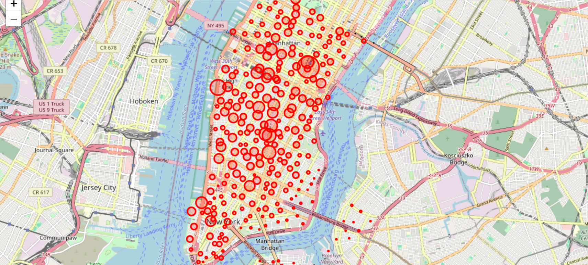
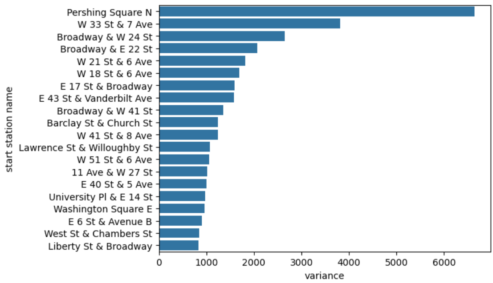

**Repository:** [View on GitHub](https://github.com/kj-data/EDA-Citibike)



## Problem

New York's Citi Bike stations suffer from inventory imbalance throughout the day — some stations empty out or overflow depending on the hour — forcing costly logistical decisions about which stations to prioritize for van-based bike rebalancing.

## Methodology

- Exploratory analysis with `pandas` + `seaborn`: trip duration distribution, correlation by user type (Subscriber vs. Customer)
- Time segmentation into hourly bands (`Morning_rush_hours`, `day_time_hour`, `evening_rush_hour`, `off_peak_hour`)
- **Variance of usage per station** across time bands — stations with high variance are the ones that fluctuate the most and need dynamic rebalancing
- Geospatial mapping with `folium` to visualize station popularity by location

```python
df3['variance'] = df3[['Morning_rush_hours', 'day_time_hour',
                        'evening_rush_hour', 'off_peak_hour']].var(axis=1)
df3.sort_values('variance', ascending=False)
```




## Results & Discussion

The analysis identified the 20 stations with the highest usage variance across time bands — priority candidates for active rebalancing, distinct from the stations that are simply the "most popular" by total volume.

## Conclusions

1. Total usage volume ≠ rebalancing need — variance across time bands is the correct indicator
2. Time segmentation (rush hours vs. off-peak) is key for urban logistics decisions
3. Next step: a predictive demand model per station/hour to automate route assignment
