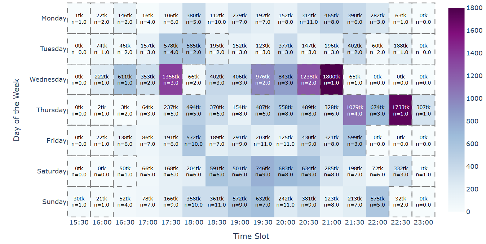
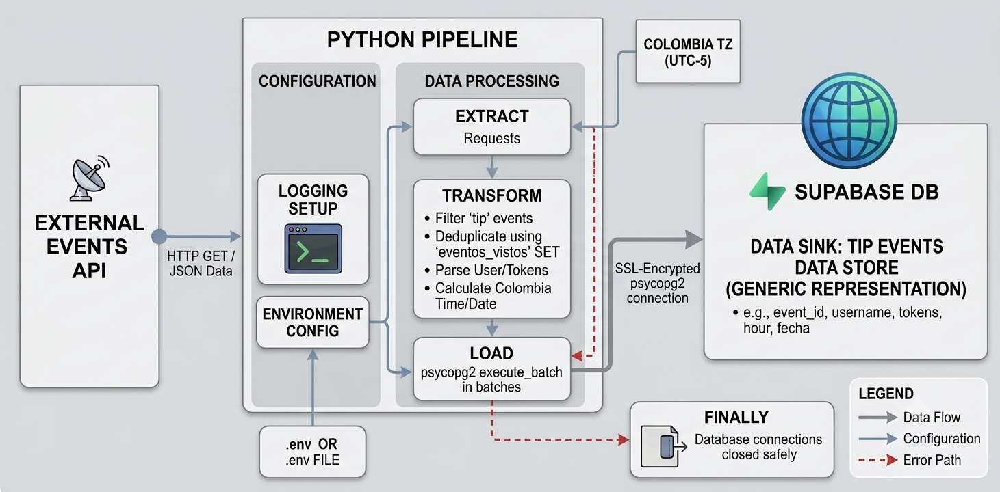
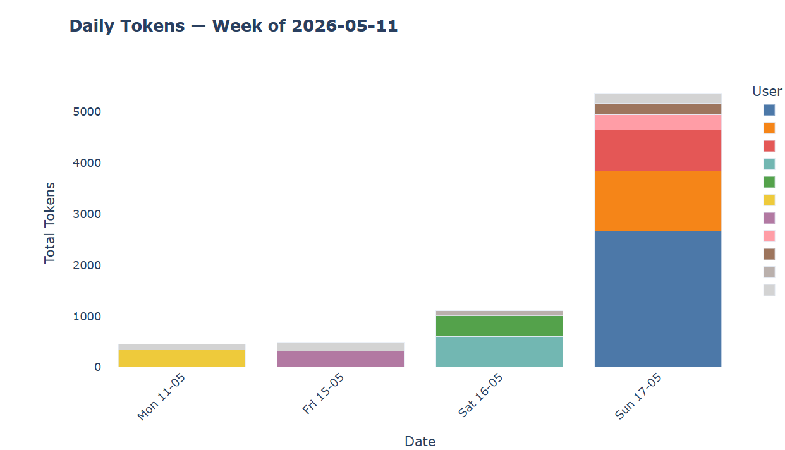

**Repositories Github:** [Ingestion pipeline](https://github.com/kj-data/token-analytics-pipeline) ·  [Dashboard](https://github.com/kj-data/token-analytics-dashboard)

**Best time to go live: which day and hour see the most activity?**




## Problem

Live-streaming platforms generate real-time interaction events (tips/donations), but without proper capture and structuring, this data is lost — making it impossible to identify audience patterns or user behavior over time.

## Methodology

- **Real-time ingestion** via long-polling against the platform's events API (`requests`, pagination handled through `nextUrl`)
- **Event deduplication** within each session and **batch insert** into PostgreSQL (Supabase) using `psycopg2.extras.execute_batch`
- **Structured logging** and connection-error handling to keep the pipeline running continuously
- **Interactive dashboard** built with Dash + Plotly: activity heatmaps by time slot/day, user ranking, concentration analysis (Pareto principle), and peak-hour detection per user

```python
# Snippet: ingestion with deduplication
if evento_id in eventos_vistos:
    continue
eventos_vistos.add(evento_id)
lote_datos.append((evento_id, usuario, tokens, hora, fecha))
```



## Results & Discussion

The dashboard revealed that the top 10 users account for a disproportionate share of total activity — a Pareto-like concentration pattern — and made it possible to identify peak engagement time slots by day of the week. It also enables instant weekly and biweekly reports to track trends in donor behavior over time.




## Conclusions

1. A real-time ingestion pipeline with deduplication is achievable even without complex streaming infrastructure (e.g., Kafka)
2. Interactive visualization — rather than static reports — makes it much easier to explore temporal audience patterns
3. Next step: extend the pipeline to track multiple channels and package it as a subscription service, monetizing the analytics to help cover hosting costs (the pipeline ran fully automated during the Railway free trial; continuous operation now requires a paid tier, as expected for production infrastructure)
